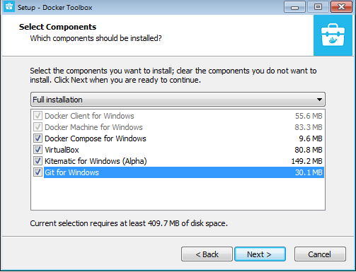
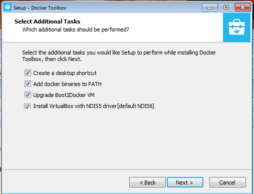
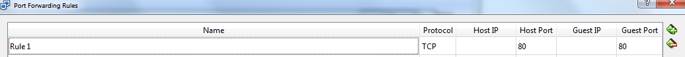

1.  Install Docker Toolbox on your machine, using the guide  [here](https://docs.docker.com/toolbox/toolbox_install_windows/) .  During the installation process, install all optional components.
    * 
	* 

2.  Reboot your system.

2.  create a new folder in your file system to hold your minnoSuite server, and download [this](./docker-compose.yml) docker-compose file into it.

3.  You can update the configuration for your server by editing the config file with a text editor.  Read about the config file [here](/minnosuitedashboard/useage/configfile).

4.  Go to the start menu and run Virtualbox.  From there:

    * Click the appropriate machine (probably the one labeled "default")
    * Settings
    * Network > Adapter 1 > Advanced > Port Forwarding
    * Click "+" to add a new Rule
    * Set Host Port 80 & Guest Port 80; be sure to leave Host IP and Guest IP empty
	* Also add port 443 and guest port 443 in another row if you want to use https.
	

4.  Open the [docker quickstart terminal](https://programminghistorian.org/en/lessons/intro-to-bash) that was included in the Docker Toolbox installation, and navigate to the folder that you downloaded the docker-compose file to, and type: 
docker-compose up

5.  You should see a message about the server being up, and be given a port and URL to use.  Enter that URL in your browser and you will be connected.  The default user is username : admin and password: admin123

6.  To get HTTPS working, first follow the guide to [setting up your domain](./domain).  Then open up the docker-compose file and edit the OWNER_EMAIL and DOMAINS fields.  Enter your email, and the domain you registered.  Change the SERVER_TYPE field to "greenlock".  Change the ports to "80:8000" and "443:8443".  "Now when you run docker-compose up it should automatically run with https.  Now connect to the site using the domain you registered and you should have https working.
